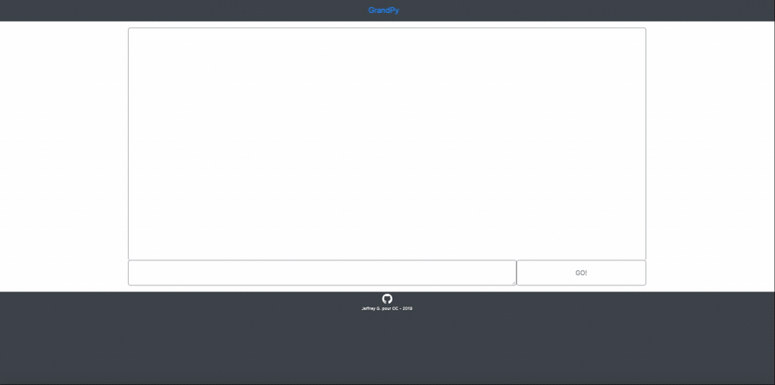

# ~~P7~~

## ~~Description~~

~~Ce dépot contient GrandPy, une application web monopage responsive créé dans le cadre du parcours développeur d'application Python d'OpenClassrooms.~~

ATTENTION ! CE PROJET EST OBSOLÈTE !! SON REMPLAÇANT, P7V2, EST DISPONIBLE ICI :  **https://github.com/Ludophilia/P7v2**

## ~~Capture d'écran~~

